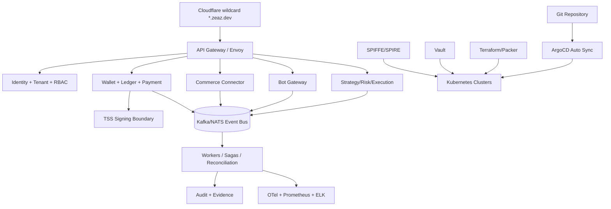

# ZeaZ/Zypto Unified Platform Refactor

## Target architecture

The unified platform is a GitOps-managed, zero-trust, event-driven Go microservice estate. All services are stateless unless explicitly declared as stateful infrastructure. Stateful systems are provisioned through Terraform/Packer and reconciled through Kubernetes operators or Helm charts.



## Service boundaries

### API layer

- `api-gateway`: public ingress, OpenAPI aggregation, OIDC login callbacks, WAF-aware headers, tenant routing, idempotency key normalization, and request trace creation.
- `admin-api`: internal platform operations, tenant onboarding, secret rotation triggers, policy publication, and audit search.
- `public-web`: Next.js/web surfaces consolidated from frontend apps; no direct secrets; calls only gateway APIs.

### Domain services

- `identity-service`: OIDC federation, WorldID integration, service account issuance, session/token introspection, and SPIFFE/SPIRE registration metadata.
- `tenant-service`: tenant lifecycle, quotas, namespace mapping, data partition policy, compute isolation policy, and plan entitlements.
- `authorization-service`: RBAC/ABAC decisions, policy-as-code evaluation, break-glass workflows, and audit-safe delegation.
- `wallet-service`: account/address lifecycle, balance projections, chain adapters, unsigned transaction building.
- `ledger-service`: double-entry journal, idempotent postings, reconciliation, settlement, clearing, and immutable audit references.
- `payment-service`: PromptPay, Stripe, banking rails, zeapay adapter placeholder, payment lifecycle state machine, refunds, chargebacks.
- `commerce-connector-service`: TikTok Shop SDK integration, webhook verifier, seller/order/product sync, replay-safe connector jobs.
- `strategy-service`: strategy registry, signed plugin manifests, tenant strategy versions, backtest definitions, paper/live mode selection.
- `execution-service`: exchange adapters, order placement, execution reports, retry policy, and idempotent exchange client wrappers.
- `risk-service`: trading limits, fraud risk, velocity checks, anomaly signals, circuit breakers, and policy decisions.
- `ai-gateway`: LLM/model routing, retrieval/vector access, tool invocation, safety checks, usage metering, and prompt/version audit.

### Workers and queues

- `saga-worker`: orchestrates wallet/payment/trading long-running workflows with compensation.
- `reconciliation-worker`: reconciles ledger, exchange fills, bank/payment confirmations, and chain indexer events.
- `notification-worker`: LINE, Telegram, email, webhook, and in-app notification delivery.
- `automation-worker`: outreach, CRM, commerce actions, scheduled jobs, and human-in-the-loop tasks.
- `mlops-worker`: model training, feature generation, registry updates, and batch inference.

### Security and cryptography

- `tss-signing-service`: stateless coordinator API plus isolated signer nodes. The coordinator never stores key shares. Signer nodes hold encrypted shares, expose mTLS-only endpoints, enforce policy, and support FROST/tss-lib backends.
- `hsm-adapter`: future PKCS#11/KMS boundary used by signer nodes to unwrap or hardware-protect shares.
- `secret-rotation-controller`: reads declarative rotation policies and updates Vault-backed ExternalSecrets.

### Infrastructure services

- `platform-operator`: validates generated manifests, domain routing, DNS records, ArgoCD app definitions, and environment readiness.
- `observability`: Prometheus, Grafana, OTel Collector, Tempo/Jaeger, Loki/ELK, Alertmanager, and SLO burn alerts.
- `gitops`: ArgoCD app-of-apps, progressive delivery controller, canary analysis, drift detection, and rollback automation.

## Event-driven contract model

All side effects must be represented as events with a deterministic envelope:

```json
{
  "event_id": "uuid-v7",
  "event_type": "wallet.transfer.requested",
  "event_version": "1.0.0",
  "tenant_id": "tenant_...",
  "actor_id": "user_or_service",
  "trace_id": "otel-trace-id",
  "idempotency_key": "client-or-derived-key",
  "occurred_at": "RFC3339",
  "payload": {},
  "policy": {"classification": "confidential", "retention": "7y"}
}
```

Mandatory patterns:

1. API writes command intent and outbox record in one transaction.
2. Worker consumes event, writes inbox/de-duplication record, performs side effect, and emits result.
3. Failed events go to DLQ with structured reason and retry metadata.
4. Audit service receives immutable summaries for every request, decision, side effect, and signer operation.

## Configuration model

| Environment | Source of truth | Secrets | Domain | Persistence |
|---|---|---|---|---|
| `dev` | local `config/dev.yaml` + generated KinD/k3d manifests | Vault dev server or SOPS test keys | `*.dev.zeaz.dev` or local wildcard | Disposable unless explicitly retained. |
| `staging` | Git branch/tag + Terraform workspace `staging` | Vault namespace `staging/` | `*.staging.zeaz.dev` | Persistent test data with scheduled reset. |
| `prod` | signed Git tag + Terraform workspace `prod` | Vault namespace `prod/` with rotation | `*.zeaz.dev` | HA stateful services with backups and DR. |

No script may create an untracked secret, cron job, systemd unit, Docker volume, or privileged container without writing a manifest or state file that can be reconciled.

## Cloudflare domain and dynamic routing

- Terraform provisions zone settings, wildcard DNS for `*.zeaz.dev`, certificate records, and proxied service records.
- ExternalDNS can reconcile per-service records from Kubernetes annotations.
- Gateway API routes map `service.env.zeaz.dev` and `tenant.service.env.zeaz.dev` to service backends.
- Cloudflare API tokens must be stored in Vault and scoped to DNS edit only for the target zone.

## GitOps and progressive delivery

- ArgoCD app-of-apps owns platform, security, observability, data, and application charts.
- Auto-sync is enabled with prune and self-heal.
- Drift detection is surfaced as alerts and PR comments.
- Canary deployment uses Flagger/Argo Rollouts with metric gates: error rate, p95 latency, saturation, business KPI, and signer quorum health.
- Rollbacks are Git commits or Argo Rollouts aborts; no imperative kubectl patching in production.

## Observability and SIEM schema

- Traces: OpenTelemetry SDK in all services; gateway creates trace if absent; workers propagate trace context through event headers.
- Metrics: RED/USE metrics, domain counters, signer quorum metrics, tenant usage, DLQ depth, idempotency conflicts, and fraud/risk decisions.
- Logs: JSON only with `timestamp`, `level`, `service`, `env`, `tenant_id`, `actor_id`, `trace_id`, `span_id`, `event_type`, `action`, `decision`, `resource`, `outcome`, and `reason`.
- SIEM: Logstash pipeline normalizes to ECS-compatible fields and masks PII/secrets before indexing.

## Multi-tenancy and access control

- Tenant identity is mandatory on every API request, event, DB row, object-store key, and metric/log label where safe.
- Data isolation defaults to row-level security; high-risk tenants can be assigned namespace/database isolation.
- Compute isolation uses Kubernetes namespaces, NetworkPolicies, ResourceQuotas, and optional dedicated node pools.
- RBAC is fine-grained: action/resource/tenant/scope/condition. Privileged actions require just-in-time elevation and audit reason.

## Security posture

- mTLS everywhere through Istio/Linkerd plus SPIFFE IDs for workload identity.
- Vault stores all secrets; ExternalSecrets projects short-lived credentials into pods.
- Rotation policies are declarative and audited.
- Threshold signing replaces pseudo-MPC. Signers use FROST/tss-lib backends and are deployed in isolated namespaces with no public ingress.
- HSM readiness: signer shares are wrapped by PKCS#11/KMS; HSM attestation is recorded in audit events.
- Network policies deny all by default and only allow required service-to-service paths.

## Multi-region design

- `prod-primary` and `prod-secondary` clusters share GitOps source and independent Vault namespaces.
- Global traffic management routes users to healthy regional gateways.
- Event bus uses MirrorMaker/JetStream leaf nodes depending on selected backend.
- Postgres uses logical replication for read models and explicitly designed failover for ledgers; write leader election is controlled and audited.
- Object storage uses cross-region replication.
- TSS signer quorums are region-aware so a single region failure cannot leak shares or permanently halt signing when policy allows failover.

## Go backend refactor roadmap

1. Define protobuf/OpenAPI/event schemas and generate clients.
2. Build shared Go libraries for config, logging, tracing, idempotency, authz client, event envelope, and database transactions.
3. Migrate API gateway, identity, tenant, authorization, audit, and connector skeletons first.
4. Move wallet/ledger/payment flows with golden tests from existing TypeScript/Python implementations.
5. Move trading strategy/risk/execution services behind stable contracts.
6. Migrate bot/LLM orchestration after usage metering and safety are standardized.
7. Decommission legacy installers and direct compose stacks after GitOps parity is proven.

## Duplicate logic elimination plan

- One `connector-sdk` interface replaces scattered TikTok, exchange, payment, LINE, Telegram, Cloudflare clients.
- One `risk-policy` service replaces duplicate fraud/rate-limit/circuit-breaker implementations.
- One `billing-meter` replaces bot, AI, and SaaS metering variations.
- One `audit-event` schema replaces ad hoc loggers and evidence records.
- One `tenant-context` library replaces implicit tenant resolution.
- One `bootstrap` script pair replaces repository-specific host mutation scripts.
